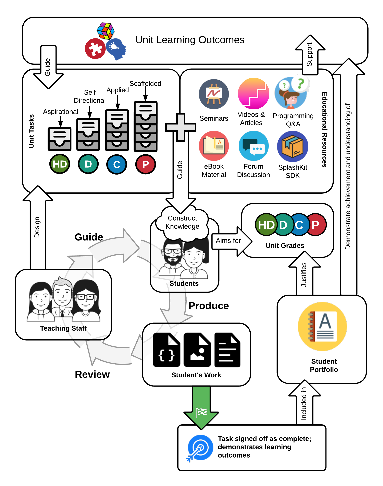
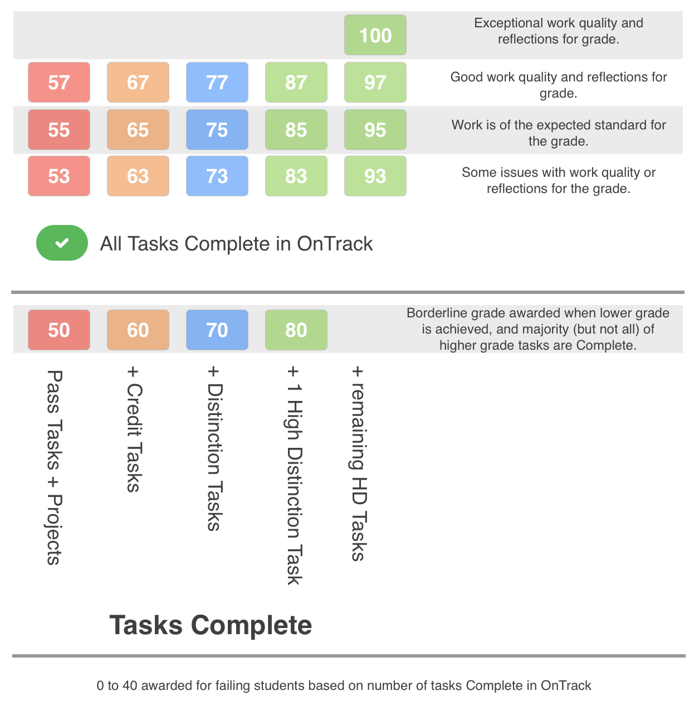

# SIT782 Project Delivery

## Unit Overview and Outcomes
This unit is one of two project-based professional practice units in the postgraduate IT suite of courses. It follows SIT764 Project Design where you will work in a multi-disciplinary team and apply everything you have learnt to deliver your project to a real client. To gain the most from this unit, it is strongly recommended you complete SIT764 Project Design first, as we will be building on your knowledge of project management methodologies.

In this unit, we will be focusing on the execution and delivery a project, particularly around the activities, challenges and outcomes in this phase of a project. You will work in teams for a project, supervised by an experienced academic staff member. Through your work as a member of the project team, you will demonstrate teamwork skills, apply project management techniques, develop a solution to a real-world problem and deliver it to the client at the end of the unit.

These are the Learning Outcomes (ULO) for this Unit

 Outcome | At the completion of this unit successful students can: | Deakin Graduate Learning Outcomes
---------|----------|---------
ULO1 | Devise strategies to analyse contextual business parameters to design and deliver IT solutions using agile or lean project management methodologies, tools, and practices. | GLO1, GLO4, GLO5, GLO6
ULO2 | Use interpersonal and communication skills to manage expectations, prioritise efforts, and resolve both technical and non-technical issues in a collaborative and consultative manner with the project team and stakeholders. | GLO3, GLO4, GLO5, GLO7
ULO3 | Advocate technical and non-technical strategies, approaches and solutions using evidence for informed professional decision making. | GLO 1, GL02, GLO4

## Detailed Assessment Information

Assessment in this unit is via a Learning Portfolio (100%).

### Portfolio Assessment Overview

This assessment method is designed to encourage and reward you for demonstrating achievement of the unit learning outcomes; with higher grades representing better achievement of these outcomes. We will be using [OnTrack](https://ontrack.deakin.edu.au), which is a web application designed specifically to support this approach. It will make this portfolio process simple and easy to work with, so keep that in mind as you read all these details.

In order to understand how this works, let’s consider standard assessment practices. A typical unit has assignments and tests that you submit and get marks for. The problem is, you only get one chance to succeed, and any marks you lose are gone. This tends to mean you focus on marks, rather than on working to achieve good learning outcomes. To focus on learning in this unit, we avoid having marks for tasks during the unit and instead assess your final work to see how well you have achieved the outcomes at the end of the unit. This is the summative assessment at the end of the unit, where your grade is determined by the evidence you present in your portfolio.

Your portfolio will consist of work that you complete in response to the unit’s tasks. These tasks are designed to help you learn, and demonstrate achievement of the unit learning outcomes.

We will work with you by providing formative feedback for these task as you submit them week by week. When you submit a task, we will review your work and provide you with feedback. Where your work does not correctly demonstrate the required outcomes, we will give you feedback to help enhance your learning and improve your work for your final portfolio submission. You then need to fix and resubmit the work, so we can check it again and sign it off as Complete when you have achieved the required standard.

We will keep track of all of this in OnTrack, which is where you submit work, receive feedback, resubmit it, and then finally see it signed off as Complete. The process for you is then just a matter of working through the required tasks week by week, and work with us to make sure they are ready for your final portfolio submission.

How do you demonstrate different grade outcomes? That is simple, each task is associated with a grade: either Pass, Credit, Distinction, or High Distinction. Get all of the Pass Tasks marked as Complete and you get a Pass. Get the Pass and Credit tasks Complete for a Credit, the Pass, Credit, and Distinction tasks for a Distinction, and all tasks for a High Distinction. OnTrack lets you select a target grade, and will show you only the tasks you need to complete in order to achieve that grade.

So, assessment in this unit is as simple as setting your target grade in OnTrack and working through the required tasks to achieve it. We will work with you providing weekly feedback so that you can achieve the goals you set by demonstrating your ability to complete and discuss the unit tasks.

Tasks will consist of the following kinds of activities:

* Procedural programs
* Program design documents and diagrams
* Analysis of program code, and demonstrations of how these programs work
* Explanations of programming concepts and terminology

This portfolio process is depicted visually in the following image:

## Final Unit Results

At the end of the unit, you will compile together the tasks you have completed together with a learning summary report into your learning portfolio and submit this for final summative grading. Your final mark in the unit is determined based on the tasks that are marked as Complete in OnTrack, the quality of your work, and the reflections you include in your learning summary report.

### Pass Results

A Pass result (53, 55, or 57) is achieved when all of the following conditions are true:

1. All of the Pass Tasks signed off as Complete in OnTrack, and demonstrate the required learning in the portfolio submission.
1. The interview component of the assessment was satisfactorily completed.
1. The learning summary report is at least minimally acceptable.
1. The portfolio was submitted for assessment, and is of a minimally acceptable standard.

When a Pass is awarded, the marks awarded will be based on the quality of the final portfolio and the reflections in the learning summary report.

* 53 is awarded if there are any issues in the quality of the work submitted or the reflections are poorly communicated.
* 55 is awarded when the work in the portfolio demonstrates the minimally acceptable standard with reasonable reflections and communication of the learning achieved.
* 57 is awarded when the work in the portfolio demonstrates the minimally acceptable standard, and the reflections and quality of tasks are well presented and communicated.

A borderline pass (50) will be awarded in cases when all of the following conditions are true:

1. At least 12 Pass Tasks are marked as Complete in OnTrack, and demonstrate the required learning in the portfolio submission.
1. All other Pass Tasks are submitted to OnTrack and of an adequate standard, but the tasks were not Complete within the unit teaching period.
1. The interview component of the assessment was satisfactorily completed.
1. The learning summary report is at least minimally acceptable.
1. The portfolio was submitted for assessment, and is of a minimally acceptable standard.

### Credit Results

A Credit result (63, 65, or 67) is achieved when all of the following conditions are true:

1. All of the Pass and Credit Tasks are signed off as Complete in OnTrack, and demonstrate the required learning in the portfolio submission.
1. The interview component of the assessment was satisfactorily completed.
1. The learning summary report demonstrates good achievement of the unit learning outcomes.
1. The portfolio was submitted for assessment, and is of a good standard.

When a Credit is awarded, the marks awarded will be based on the quality of the final portfolio and the reflections in the learning summary report.

* 63 is awarded if there are any issues in the quality of the work submitted or the reflections are poorly communicated.
* 65 is awarded when the work in the portfolio demonstrates the minimally acceptable standard with reasonable reflections and communication of the learning achieved.
* 67 is awarded when the work in the portfolio demonstrates the minimally acceptable standard, and the reflections and quality of tasks are well presented and communicated.

To be eligible for a borderline Credit (60), the portfolio must demonstrate the credit standard through good achievement of the unit learning outcomes and must as a minimum have demonstrated outcomes that meet the 57 Pass standard, with additional Credit tasks having been completed.

### Distinction Results

A Distinction result (73, 75, or 77) is achieved when all of the following conditions are true:

1. All of the Pass, Credit, and Distinction Tasks are signed off as Complete in OnTrack, and demonstrate the required learning in the portfolio submission.
1. The interview component of the assessment was satisfactorily completed.
1. The learning summary report demonstrates good achievement of the unit learning outcomes.
1. The portfolio was submitted for assessment, and is of a good standard.

When a Distinction is awarded, the marks awarded will be based on the quality of the final portfolio and the reflections in the learning summary report.

* 73 is awarded if there are any issues in the quality of the work submitted or the reflections are poorly communicated.
* 75 is awarded when the work in the portfolio demonstrates the minimally acceptable standard with reasonable reflections and communication of the learning achieved.
* 77 is awarded when the work in the portfolio demonstrates the minimally acceptable standard, and the reflections and quality of tasks are well presented and communicated.

To be eligible for a borderline Distinction (70), the portfolio must demonstrate the Distinction standard through good achievement of the unit learning outcomes and must as a minimum have demonstrated outcomes that meet the 67 Credit standard, with additional Distinction tasks having been completed.

### High Distinction Results

A High Distinction result (83, 85, or 87 and 93, 95, 97, or 100) is achieved when all of the following conditions are true:

1. The custom project is of the High Distinction standard, and/or the High Distinction task is signed off as complete. (One task awards 83, 85, or 87, both are required for the range 93, 95, 97, or 100)
1. All of the Pass, Credit, and Distinction Tasks are signed off as Complete in OnTrack, and demonstrate the required learning in the portfolio submission.
1. The interview component of the assessment was satisfactorily completed.
1. The learning summary report demonstrates excellent achievement of the unit learning outcomes.
1. The portfolio was submitted for assessment, and is of a good standard.

When a High Distinction is awarded, the marks awarded will be based on the quality of the final portfolio and the reflections in the learning summary report.

* 83/93 is awarded if there are any issues in the quality of the work submitted or the reflections are poorly communicated.
* 85/95 is awarded when the work in the portfolio demonstrates the minimally acceptable standard with reasonable reflections and communication of the learning achieved.
* 87/97 is awarded when the work in the portfolio demonstrates the minimally acceptable standard, and the reflections and quality of tasks are well presented and communicated.
* All 97 results will be reviewed by the teaching team and in cases where the work is of exceptional standard the portfolio will be awarded a result of 100.

### Visual Rubric of Assessment Process

The following rubric illustrates how your final grade is determined.

