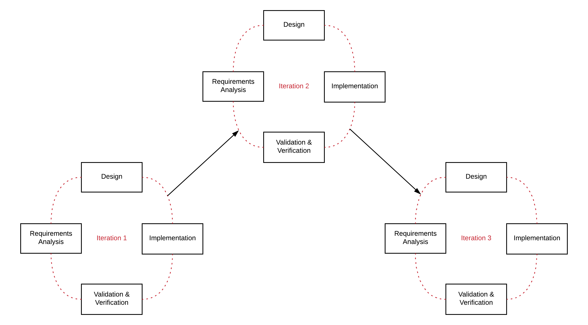

# Agile methodology

**Agile is a project management methodology based on the idea that each project is unique and as a consequence, the lifecycle model must be able to be adapted in order to cater to the needs of each project. **

What this means is that, while the general guidelines for agile can be carried over from project to project, they can be tweaked to suit the project and its requirements.

The agile process is depicted below. As you can see, an agile project consists of iterations, which represent some form of system functionality. Like in the [iterative lifecycle](https://www.futurelearn.com/courses/sit782-1/1/steps/321864), at the completion of each iteration the system is in a functional state.

## Agile methodology
The agile methodology can be defined by four principles:

* **Functional solution** - having a functional solution constructed in either a single or many iterations is much more valuable than documentation purporting to describe the system, especially for stakeholders.

* **Customer collaboration** - maintaining a continuous connection with the customer is important for identifying requirements and defining an appropriate solution.

* **Responding to change** - an agile project must be able to quickly respond to any changes, adjusting the project efforts as required.

* **Individuals and interactions** - Motivation and organisation of each individual working on a project is important, as are productive interactions such as pair programming (working in pairs to implement the system).

### Advantages

* Can have a positive influence on teamwork and cross discipline training through activities such as pair programming.

* Each iteration implements components therefore a functional artefact can be demonstrated to key stakeholders at regular intervals.

* Accounts for the reality that requirements can and do change and reflects this in the way the project is run.

* Continual integration with the customer helps to ensure the project is moving in the right direction.

* Obtaining continual customer feedback enables the project team's to (ideally) maximise the value of the system to the customer.

### Disadvantages

* Continual customer feedback could result in scope creep due to continually changing requirements based on customer input.

* Overall project schedules and costings are difficult because of the continuous change in the project.

* Requires motivation from the project team to commit to continual processes.

## Your Task
Have you ever worked using an agile methodology? What agile frameworks have you heard of? Share in comments.