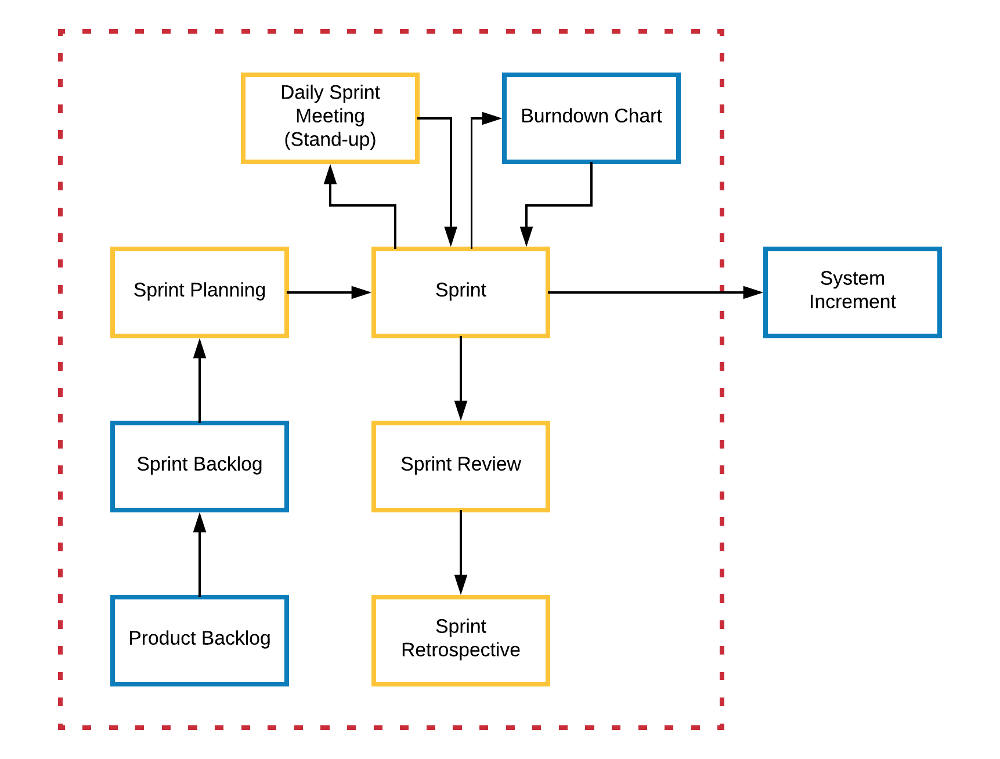

# Scrum framework

**In Scrum, the emphasis is on the project team and customer working together to build a solution that becomes more and more like the desired product.**

Being an agile framework, Scrum is particularly useful for complex projects that are continually updated.  The Scrum framework focuses on delivering the solution in a number of iterations, or Increments, and can be used to develop software projects within a team-centred environment. 

It's important to understand that Scrum is not actually a process or technique used to develop software systems, rather it is a framework that provides a structure in which the required processes and techniques can be implemented. 

Any processes and techniques that are not viable, or have failed, can be removed and replaced with more viable solutions.

There are a number of factors that make up the Scrum framework and they are detailed below. The diagram provided covers the events (yellow boxes) and artefacts (blue boxes) associated with a Scrum project.

## People
There are a number of people involved in a Scrum, they are:

- **Product Owner** - the customer that has invested in developing a solution that caters to specific business needs. 

>  **Pro Tip:** This is your client.

- **Scrum Master** - provides an array of services to the project including interacting with the product owner (customer), overseeing the project as a whole and working with and developing the skills of the development team. 

>  **Pro Tip:** This is not to be confused with ownership. The Scrum Master helps _facilitate_ the Scrum. Every member still has to accurately and effectively communicate the progress and risks of their respective components so that a resolution may be reached.

- **Project Team** - the individuals who make up the project team including analysts, designers, programmers, developers etc. _(The rest of the team.)_

>  **Pro Tip:** Being a team member does not exclude you from the higher grades. You can take ownership of a project component to help steer the final solution.

## Events
The events that occur within a Scrum project are highlighted in yellow boxes in the diagram above:

- **The Sprint** - Scrum is centered around Sprints. In each Sprint a unique piece of functionality is added to the system. Each addition is referred to as an increment. Each Sprint has a strict time period in which it must be completed, which can range from one week up to one month. 

>  **Pro Tip:** We use 2 week Sprints in this unit, your first Sprint commences from week 3!

- **Sprint Planning** - is the process used to plan for a Sprint and understand the context of what the Sprint will implement. 

>  **Pro Tip:** This event produces your Sprint Backlog.

- **Daily Scrum Meetings (Stand-ups)** - a brief meeting conducted each day in order to establish a clear view as to what has been achieved since the previous daily meeting and to plan for the next 24 hours of project development. Typically, these meetings take 15 minutes. 

>  **Pro Tip:** Don't book a room, don't sit down! This is meant to be short!

- **Sprint Review** - held at the end of every Sprint to review the Increment that was developed. This provides an opportunity to showcase the system to the product owner and any relevant stakeholders. 

>  **Pro Tip:** This Increment is the same artefact you Demo in weeks 6, 8 and 10.

- **Sprint Retrospective** - this is held after the Sprint review has occurred and provides an opportunity to analyse and critique the processes and techniques used during the Sprint. This information can be used to plan the next Sprint. 

>  **Pro Tip:** This event produces your Sprint Retrospectives to be submitted in OnTrack.

## Artefacts
There are a number of artefacts that are produced by Scrum projects, highlighted in the diagram above as blue boxes:

- **Product Backlog** - represents all of the features and components that the final solution should ideally implement in a complete state, typically categorised in order of priority. As new features and components are identified, the product backlog grows.

>  **Pro Tip:** Have ideas about the project? Create a swim lane in Trello called the Product Backlog, articulate your idea in a card and add it to the Product Backlog.

- **Sprint Backlog** - represents all of the features and components that a specific Sprint will implement. The Sprint backlog is compiled by identifying the items within the product backlog that need to be implemented in the next Sprint.

- **Increment** - the solution artefact output of a Sprint, which is delivered when a Sprint is completed.

- **Burndown chart** - provides a visual representation of the amount of effort involved in developing a Sprint. 

## Your task

Watch [this series of videos](https://www.youtube.com/watch?v=9Jgu1BlTlSc) to get an idea of how Scrum is applied and see how it compares to another flavour of agile called Kanban. Reflect on the strengths and weaknesses of Scrum and Kanban in the comments.
