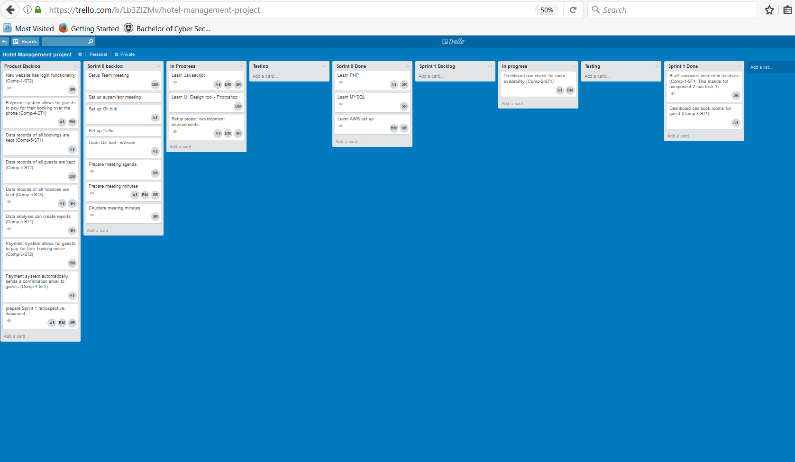
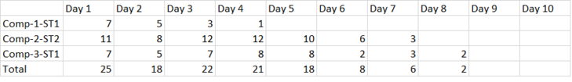
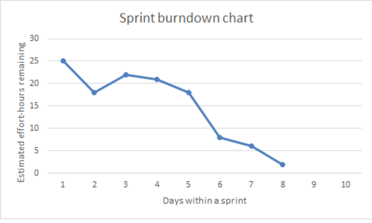
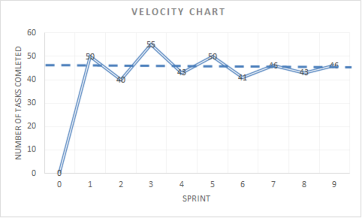

# Progress monitoring in Scrum

**Scrum teams can visually monitor the sprint progress using three methods, namely the task board, sprint burndown chart and velocity chart (Rubin 2013; Green 2016).**

Earlier we looked at the Agile principles and the scrum framework for project management. We discussed various roles and activities that are performed in the scrum process.

It is important to track the progress of the scrum activities regularly to see how well the deliverables are developed.

Since the scrum process includes frequent communication among the team and sharing of information among them during various scrum events, the general progress will be known to all the members involved in the scrum. However, in order to track and visualize the progress effectively, we can use some charts and boards.

## Task board
Since the sprints are short timeboxed process (ie fixed time sprints such as a 2 week sprint) working with a small team, monitoring and communicating the progress will be easier.

A typical task board will have items such as the product backlog, task to do (spring backlog), tasks in progress, and tasks completed. This gives a visual means of monitoring the flow of work through its various stages.

One way to monitor progress is to use the task board, such as a [Trello board](https://trello.com/). An example Trello board is shown below, using a Hotel management software as an example.

## Sprint burndown chart
Sprint burndown chart provides a plot of estimated effort-hours remaining versus days within a sprint. This chart is useful for tracking progress, and to predict when the work will be completed, by computing a trend line based on the historical data.

In order to produce this chart, each day during the sprint executions, the team members can update the estimate of how much effort remains for each uncompleted task. A table can be created with this information as shown below.

Sprint backlog with estimated effort remaining each day

The sprint burndown chart for the above table is shown below. The total effort-hours across all unfinished tasks is used for the vertical axis. 

## Velocity chart
A velocity chart aims to assist the scrum teams by allowing them to measure the amount of tasks they can complete during a typical sprint.

The concept is simple, the team will track over time how many tasks they are able to complete for every sprint. Over time the team will slowly build a more reliable estimation of how many tasks they are actually able to complete within a sprint, based on how many tasks they have completed over all their previous sprints.

It is the responsibility of the scrum master to keep track of how many tasks the scrum team was able to complete for each sprint.

The estimation and completion of tasks during a sprint will be inaccurate at the beginning of the project, which is understandable as the scrum master and the scrum team don’t know yet how many tasks they are able to complete within a sprint.

Over time however, as more sprints are completed, the scrum master and the scrum team will become more accurate with their estimations. For example, the scrum team may complete 50 tasks in sprint 1, 40 in sprint 2, 55 in sprint 3, and then 45 in sprint 4, averaging 46 tasks per sprint.

The figure below shown is an example of how a velocity chart may look when tracking completed over time.

It is important to note that this chart is not supposed to see number of tasks per sprint continually rise (as you would hope to see in a chart that measures company profits for example). Its purpose is to measure how much work a scrum team is able to complete within a sprint on average, to better guide the scrum master when planning future sprints.

## Your task
In your project, one of the ways that you will be reporting the weekly progress is using the Team Work Log. Your Team Work Log is a shared document that indexes the work and “billable hour” efforts of all team members. This shared document is updated whenever you have completed a body of work to produce an outcome.

### References
* Rubin, KS 2013, _Essential scrum: a practical guide to the most popular agile process, 1st edn, Addison-Wesley, ISBN: 978-0137043293
* Green, D 2016, _Scrum: novice to ninja: methods for agile, powerful development, 1st edn, ISBN: 978-0994346919