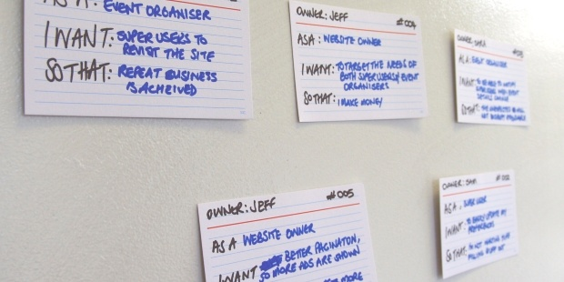

# Creating user stories

**Get stakeholders together with pen and paper writing simple statements on what the personas defined for the project will need the software to do and why.**

User stories are created as follows:

## Begin with epics
Before jumping into writing your user stories, start thinking about epics first.

An epic is a larger story which describes the bigger-picture product features that are to be broken up into your user stories.

You can think of epics as a rough scope of the work your feature will perform, which helps avoid duplication and inconsistencies among user stories.

## Get together with pen and paper
Meet with all stakeholders to work collaboratively on the user stories.

User stories are simple enough that people can learn to write them in a few minutes.

Simple tools such as sheets of paper, paper cards, or large post-it notes are easy to use and facilitate collaboration.

## Put your personas to use
In a previous step, you learned how to define the different personas that are expected to use your software.

Each persona will have a defined goal they want to achieve or problem they want solved by the software.

Ask yourself what functionality the product should provide to meet the goals of each persona to create user stories.

## Keep it simple
When writing your user stories, start with a simple statement, for instance:

> Customers can purchase food

Refine this statement using the **who**, **what** and **why** template, so that you end up with a clear, concise, feasible and testable user story.

> As a customer, I want to purchase food online, so that it can be delivered to my home

*Image from Equinox IT - 3 key take outs for writing better user stories*

Tips:

* Avoid using confusing or ambiguous terms to ensure anyone in the project team can understand the context.

* Avoid circular user stories, such as: “As a customer, I want to change my password, so that I have a new password”. Describing the why or reason provides extra context and describes the value of the action to the user. A more useful user story would be: “As a customer, I want to change my password, so that I can log back in after I’ve forgotten my password”.

* Don't forget to add an identifier to your user stories. This will make it much easier to refer to them later.

## Indicate priority
To help plan iterations of work, it is vital to communicate the importance of specific product features to the development team. This can be done by adding a priority to each user story.

There is no single best method to do this, but stick with a consistent strategy that works for the project team. Some tips on indicating priority will be covered in the next step.

## Your task
Check ['10 Tips for writing good user stories'](http://www.romanpichler.com/blog/10-tips-writing-good-user-stories/).
