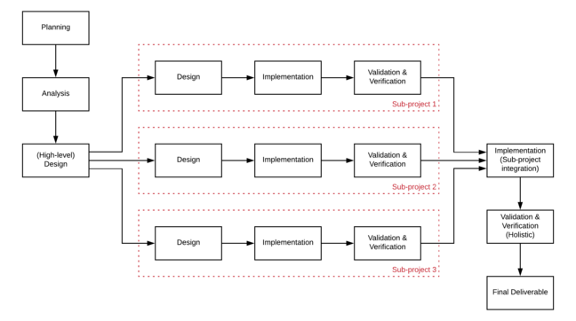

# Parallel lifecycles

**Let's explore several lifecycle models you can adopt in your project execution for mitigating the risk of flawed requirements. We will start with parallel lifecycles.**

Requirements analysis is an extremely complex task, and flawed requirements are not uncommon. Some project lifecycles are good for mitigating the risk of flawed requirements. For example:

* parallel lifecycles
* iterative lifecycles
* prototyping lifecycles.

## Parallel lifecycles

Parallel lifecycles is a concept used to break projects down into smaller sub-projects, so that they may be implemented concurrently, or in parallel.

These sub-projects each make up a specific section of the main project and contribute to the project holistically.

For instance, you may have a sub-project focused on data storage and processing, and another sub-project focused on user interface. When both sub-projects are complete, they are integrated to produce the complete system.

## Implementing in parallel
The diagram below demonstrates the essence of parallel implementation.

As shown by the model, a parallel implementation project begins with planning, analysis and high-level design.

The high-level design identifies the main components of the system, which can then be designed in detail, implemented validated and verified separately.

After the sub-projects are complete, they are combined in a final implementation step. In this step, the components produced in the sub-projects are made to interface with each other so that they can collectively function as the final deliverable.

The integrated deliverable is then holistically validated and verified against the requirements before acceptance as the final deliverable.

### Advantages

* implementation progresses on a number of key components simultaneously
* implementation efforts are not centered around completing the project as a whole, but rather, implementing the project as a number of isolated modules
* the set of requirements of a sub-project are specific to the needs that the sub-project aims to deliver
* the scope of deliverables for each sub-project is smaller because each is independently implemented
* once a sub-project is complete, the aspect of the project that it represents can be signed off as complete.

The parallel implementation model reduces risk because it limits the impact of errors discovered later in the project. For example, if an incorrect requirement was identified during analysis then it can only affect the work performed in the sub-project that is designing and implementing that requirement. Also, since sub-projects are developed simultaneously, flawed requirements can be identified sooner.

### Disadvantages

* sub-projects eventually need to be integrated together to create the final deliverable
* sub-project components may work in isolation but may not work a cohesive whole once integrated
* integration of sub-projects may require additional implementation to ensure that they work together correctly and cohesively
* a sub-project may depend on another sub-project, which could limit the value provided by the parallel implementation lifecycle
* establishing project scope can be complicated and drawn out since the scope and requirements for each sub-project need to be identified before work begins.

