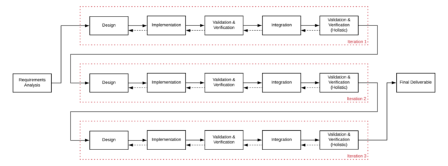

# Iterative lifecycles

**The iterative approach seeks to implement a project in a number of incremental steps, where each iteration builds upon the project deliverable by adding some form of refinement or new component(s).**

The idea is to implement incrementally, with each implementation representing a new major component of the final deliverable.

It is typical to start off with some form of functioning or fleshed out base level components, which each iteration builds upon.

For example, a web community software system may start off with a platform that enables authenticated users to post messages in forums. Each iteration will add further functionality such as user profile pages, photo galleries, etc.

## Implementation of the iterative lifecycle
The image below is representative of an iterative approach.

The dotted arrows indicate that the project team can return to a previous activity to address issues they identify in the current activity.

Note that requirements analysis occurs before any iterations start, as it is still necessary to understand what work is to be done.

The requirements need to be prioritised so that they can be allocated to a specific iteration of the project execution. This is extremely important, since prioritising the wrong requirements can cause the customer to have to wait through one or more iterations before they can observe and interact with the components they consider crucial.

It is also important to be careful to ensure that the requirements implemented in each iteration result in an artefact that can be considered, in some respect, complete. At the end of each iteration, the artefact should be in a state in which it is usable and all existing components are complete (eg they don't depend on planned components).

### Advantages

* every incremental build produces a functioning artefact
* implementation progress can be observed by the customer as soon as the first iteration is completed.
* can be used for adding additional components to an existing system
* can incorporate parallel implementation, allowing multiple components to be implemented concurrently
* testing is simplified because tests can be designed for single iterations.

The main advantage of the iterative lifecycle is that the customer can provide feedback after interacting with the artefact at the end of each iteration. This enables them to adjust the requirements of the project to meet the customer's needs without much impact on other phases.

### Disadvantages

* must be careful when incorporating the feedback of the customer into the existing requirements, especially if that feedback contradicts existing requirements implemented in earlier iterations
* project teams may choose to start an iteration before requirements analysis is completed, which may save time but may result in the first iteration addressing incorrect or low priority requirements
* generally there is no concrete end date for the project as the system is being implemented iteratively over an extended period of time
* [scope creep](https://www.wrike.com/project-management-guide/faq/what-is-scope-creep-in-project-management/) can occur if the project team is not disciplined in setting the scope for each iteration.

