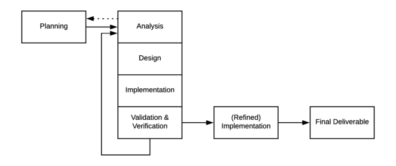

# Prototyping lifecycles

**Prototyping lifecycles iterate on an aspect of the project, with the intention of quickly and inexpensively finding an approximate solution which can then be refined into the final deliverable.**

This is in contrast to the iterative lifecycles discussed previously,in which the project team iteratively extends the features and components of the solution, ideally getting it closer and closer to the optimal deliverable solution for solving the customer's problem.

Prototyping lifecycles provide the following advantages to project teams:

* customers can be involved in the artefact's design and provide early feedback
* implementations capture requirements in concrete form
* required changes to the solution are identified early.

Let's have a look at two types of prototyping lifecycles:

* the evolutionary prototyping lifecycle
* the throw-away prototyping lifecycle.

## The evolutionary prototyping lifecycle

In the evolutionary prototyping lifecycle, the solution that is iterated on by the project team is the final deliverable itself.

A series of iterations involving analysis, design and implementation are performed to be validated and verified. The result is a simple version of the solution that contains some core features and components that can be demonstrated to the customer.

The customer then provides feedback as to how effective they believe a refined version of the current solution might be.

If the customer rejects the prototype, then the project team simply incorporates the customer's feedback into the next prototype. A rejected prototype is an unfortunate loss in terms of project time and resources, but it is much less expensive to identify errors early in the project.

If the customer accepts the prototype, then the prototype is expanded and refined, or evolves, until it has reached the quality expected by the customer.

## The throw-away prototyping lifecycle
Throw-away prototyping also involves creating prototypes but with each prototype being discarded after it has been evaluated.

The purpose of throw-away prototyping is to rapidly iterate on a design and to make sure that design is sound before progressing to the implementation of the final deliverable.

Note in the above figure, that in the throw-away prototyping lifecycle, the detailed analysis and design steps result in a design prototype.

The prototype is then implemented. If the implemented prototype is a suitable solution to the problem, the design is further refined and the final deliverable is built according to that design.

Otherwise, the prototype is discarded and detailed analysis and design is performed again.

This approach enables the project team to have multiple attempts at getting the detailed analysis and design correct before committing to the full implementation of the deliverable solution.

This lifecycle results in a more thorough analysis and design than the evolutionary prototyping lifecycle, but often requires more time and resources.

## Your task

The lifecycles we've seen attempt to mitigate risk in the analysis and design phases of the project. Which lifecycle do you think would be most appropriate for the project you would like to work on?

Leave a comment with one sentence describing the project, the most suitable lifecycle model to adopt, and why. Feel free to give constructive feedback to your peers by commenting on their responses.
