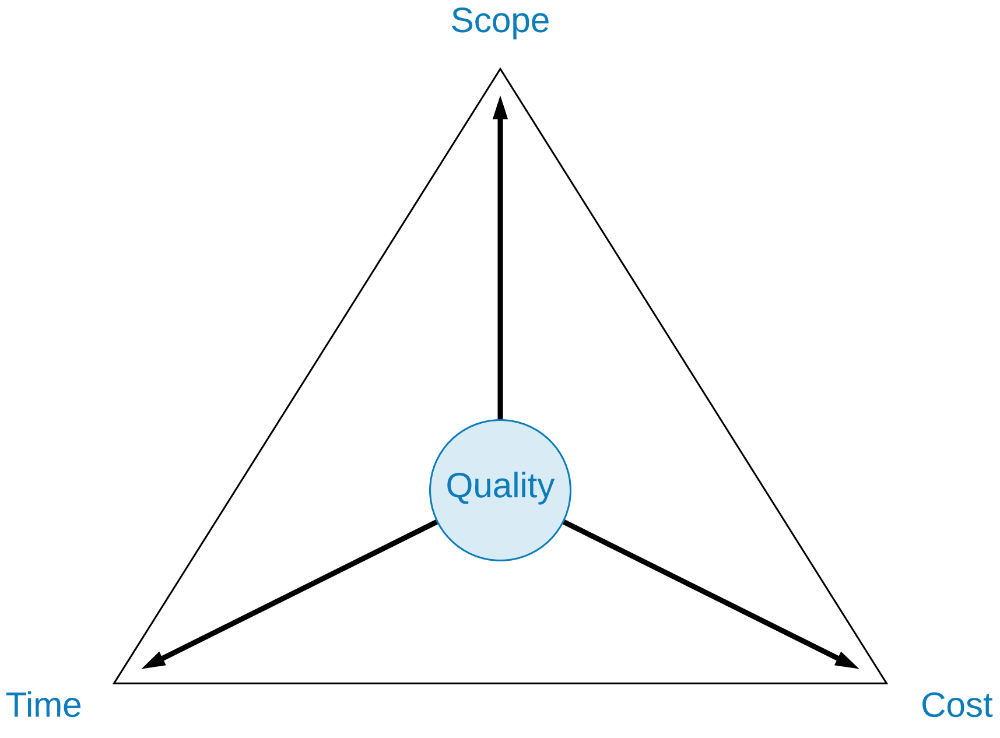

# The triple constraint

**Completing projects based on specific requirements involves understanding the invisible forces that can impact projects: scope, cost and time.**

The universality and enormity of these forces can substantially alter the system that is constructed, which makes awareness of them critical for systems analysts.

The forces that affect project quality are captured and documented using the quality triangle model, depicted below.

Each corner represents a force on the quality of the project shown in the middle of the triangle. The forces are scope, cost and time. The aspects of the triangle are defined below.

## Scope
The Scope of a project is based on the requirements that are agreed upon with the client. This defines what will be included in the project, including the necessary functional and non-functional requirements.

Ideally, the scope should be locked down during the early phases of the project development lifecycle, before development has commenced.

However, in practice clients often do not know what they want until they see something that is not what they want. As a consequence, the scope of a project can easily change and when this continues without check it is referred to as scope creep.

## Cost
Cost refers to the budget required for completing the work defined by the scope of the project.

Typically, the cost of a project is fixed and development ceases once the client has run out of money to pay the developers.

Poor upfront requirements analysis can lead to a blow out in costs, for example, additional technical challenges are uncovered that were not budgeted for.

## Time
Time-to-market is an important concept in project, as it can be the deciding factor as to whether the product is a success or a failure.

Project teams are often under time constraints to meet deadlines imposed by the commercial reality. Common reasons for time pressure include:

- new features that must be ready for marketing purposes
- the requirements change and 'lost' time needs to be recovered
- the project team is downsized or needs to upskill
- poor estimations of the time it takes to complete the work

## Quality
Quality is difficult to achieve and understanding the quality requirements for a system requires thorough analysis.

A common challenge to achieving quality is that the quality requirements are often implied, ie everyone expects a mobile app to be fast, but the client may not specify that as a requirement.

It takes significant effort to build quality into a product and often early design decisions influence the final quality.

## Dealing With Compromise

Dealing with competing forces team members managers to make tradeoffs.

The type of tradeoff that needs to be made is dependent on the circumstances of the individual project.

Two common strategies are:

* to cut quality
* to cut scope

### Cut Quality
Often the quality of a project is compromised as this is the simpler approach and often has no immediate impact, especially since quality issues may only surface after the system is delivered.

When cutting quality, the expected features of the system are delivered but the functionality that supports them may not operate in an ideal way. Such issues may not be externally visible, enabling the project team to deliver on the expectations of the customer, but risks to the continued operation of the features may have been introduced.

To mitigate these risks, the project team must document decisions made with respect to quality and anticipate the implications of those decisions.

### Cut Scope
Cutting the project scope can be a good first approach. This is ideal as many users do not use all of the features implemented in a product.

To achieve this strategy, strong negotiation skills are required with the client to decide upon which features will not be implemented in this version and which features are essential.

This strategy is not always possible because some features may be announced through various marketing strategies, which makes them ineligible to be cut.

## Choosing a Strategy
Deciding which strategy to use in any given situation is challenging.

Often there is no clear cut decision and analysing the situation and to get a clear understanding of the influences at play is required.

In these situations, it is critical that the systems analyst is able to communicate the relative importance of each requirement to the project team to help guide decisions as to where it is possible to cut scope or quality.

Accepting that there is no optimal solution and focusing on learning from the decisions that are made will help move the project forward. Ultimately, shipping a product is essential as development has to make money for the business to stay alive.
