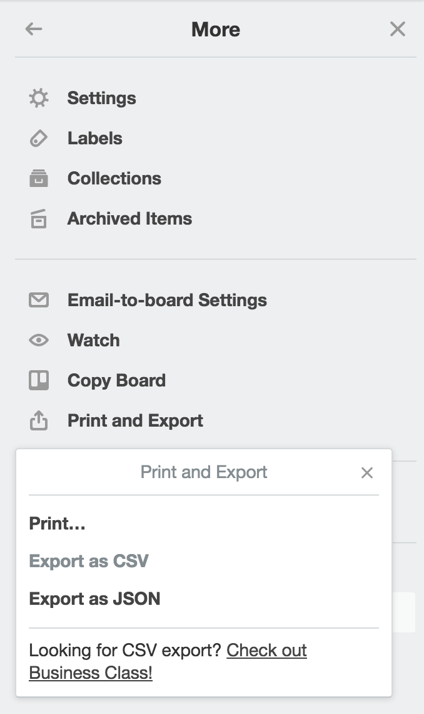

# SIT764 Project Design
## Team Pass Task 11.4: Trello Export and Submission

### Overview of the task
Now that you have delivered your project to your client/sponsor, we start to wrap up our efforts for this project. In this task, your team will need to export your Trello board for submission into [OnTrack](https://ontrack.deakin.edu.au).

#### Submission Details
Export your Trello board to a JSON file and submit it via [OnTrack](https://ontrack.deakin.edu.au). This is a **team** submission, submit only one trello export to OnTrack per team.
#### Instructions

1. Go to your Trello board and export it to JSON. This function can be found on the right menu under `Print and Export`, as depicted below.

2. Copy the output from the browser, ensuring you select all of the document. You can ensure this by using `Cmd` + `A` on OSX or `Ctrl` + `A` on Windows to `Select All`.

3. Copy the JSON using `Cmd` + `C` on OSX or `Ctrl` + `C` on Windows.

4. Open Notepad++ or any advanced Text Editor and use `Cmd` + `V` on OSX or `Ctrl` + `V` on Windows to paste it into the document.

5. Save as a JSON file using the `.json` extension, naming it `team-` + number/name + `-trello`. The saved file should look like `team-10-trello.json`.

6. Submit the your team's trello JSON via [OnTrack](https://ontrack.deakin.edu.au).

